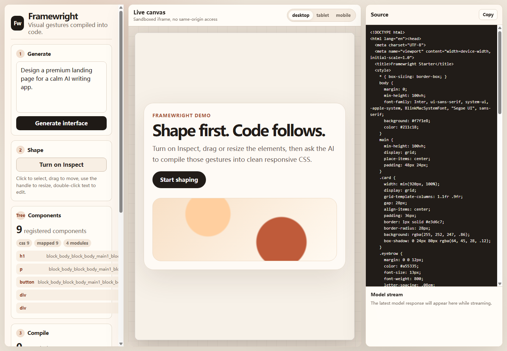
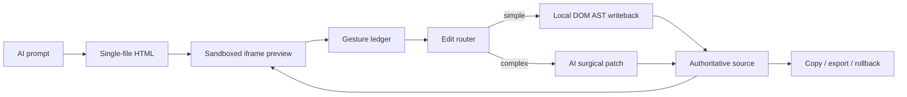

# Framewright

[简体中文](./README.zh-CN.md)

Framewright is an open-source visual editing framework for AI-generated front-end prototypes. It lets users generate a single-file HTML interface, reshape it directly in a sandboxed preview, and keep the source HTML, preview canvas, history, rollback, copy, and export paths in sync.

> Shape first. Code follows.



## What It Does

Framewright is focused on the editing technology, not a demo target app. The core idea is a dual-layer editing pipeline:

1. AI generates or updates a self-contained HTML prototype.
2. The user selects, drags, resizes, and edits elements in an iframe preview.
3. Framewright records every visual change as a structured gesture.
4. Simple edits are applied immediately to the authoritative HTML source through a DOM AST adapter.
5. Complex structural edits are routed to an AI surgical patch flow.
6. The updated source is synced back to the preview and stored in rollback history.

This avoids waiting for a model when the edit is deterministic, while still preserving AI help for complex layout or creative changes.



## Features

- React + TypeScript + Vite application.
- Sandboxed iframe preview using `srcdoc`.
- Inspect mode with hover, selection, drag, resize, and inline text editing.
- Stable ID mapping with `data-fw-id`, `data-block-id`, and `data-frame-id`.
- Virtual component tree, component registry, shadow mapping, and scoped CSS extraction.
- Dual-layer source editing through `SourceEditAdapter`.
- Local DOM AST fast path for size, position, text, and style edits.
- AI surgical patch fallback for complex layout or structural changes.
- Patch snapshots and rollback ledger.
- Prompt pruning, semantic cache metadata, and AI call metrics.
- Architecture audit script that checks the required modular capabilities.
- Copy/export locking while unsafe background sync is running.
- OpenAI-compatible streaming chat completions.

## Requirements

- Node.js 24 or newer
- npm
- An OpenAI-compatible chat completions endpoint if you want AI generation or AI patching

The app can still run locally without a model key, but AI generation and AI fallback routes will not work until API settings are configured.

## Quick Start

```bash
npm install
npm run dev
```

Open the Vite URL shown in the terminal, usually:

```text
http://localhost:5173
```

Production build:

```bash
npm run build
npm run preview
```

## API Configuration

Framewright calls an OpenAI-compatible `/chat/completions` endpoint from the browser.

Default local settings:

- Base URL: `https://api.deepseek.com/v1`
- Model: `deepseek-chat`

For public hosted deployments, do not expose provider API keys in browser JavaScript. Put model calls behind a backend proxy:

1. Browser sends prompt and gesture data to your backend.
2. Backend attaches the provider API key.
3. Backend streams the model response back to the browser.

## How To Use

1. Enter a prompt and generate an interface.
2. Turn on Inspect.
3. Click an element to select it.
4. Drag the selected element to move it.
5. Use the resize handle to change size.
6. Double-click text to edit copy inline.
7. Review the gesture ledger and component tree.
8. Let local source AST sync apply simple edits immediately.
9. Use AI compile only when the edit needs structural reasoning.
10. Copy or export once sync is complete.

## Editing Model

Framewright has two editing layers:

- Source layer: the authoritative single-file HTML document shown in the source panel.
- Prototype layer: the iframe preview used for visual interaction.

The source layer is the source of truth for copy, export, rollback, prompt construction, and history. The preview layer captures interactions and mirrors the latest source state.

Simple edits use the local source AST path:

- `resize`
- `move`
- `editText`
- safe style changes

Those edits are written back as scoped source updates, usually under:

```html
<style data-fw-scope="fw-source-edits">
```

Complex edits use AI fallback:

- adding or deleting components
- large layout restructuring
- changes that cannot be safely mapped to one target
- ambiguous natural-language instructions

## Architecture

Important modules live under `src/architecture`:

- `dom.ts`: component tree, registry, ID injection, scoped CSS, shadow mapping
- `sourceEdit.ts`: HTML source adapter and local DOM AST fast path
- `prompt.ts`: component-scoped prompt pruning, route metadata, cache key generation
- `patch.ts`: patch snapshots, component replacement validation, rollback helpers
- `metrics.ts`: AI/local route timing and prompt metrics
- `manifest.ts`: modular runtime manifest for future micro-frontend extraction

Architecture decision records are in:

```text
docs/architecture/
```

See the illustrated architecture guide: [docs/ARCHITECTURE.md](./docs/ARCHITECTURE.md).

## Scripts

```bash
npm run dev                 # Start local dev server
npm run build               # Type-check and build production assets
npm run preview             # Preview production build locally
npm run lint                # Run ESLint
npm run test                # Run architecture tests
npm run audit:architecture  # Verify required modular architecture capabilities
```

Before publishing or opening a pull request, run:

```bash
npm run lint
npm run build
npm run test
npm run audit:architecture
```

## Security Notes

Generated HTML runs in an iframe with:

```html
sandbox="allow-scripts allow-forms allow-modals allow-popups"
```

The iframe intentionally does not use `allow-same-origin`, so generated code should not share the parent app origin or directly read parent `localStorage`.

Important cautions:

- Generated HTML can run JavaScript inside the iframe.
- Generated HTML can make browser network requests.
- Browser-stored API keys are only acceptable for local experimentation.
- Public deployments should use a backend proxy for model calls.
- Treat untrusted generated HTML carefully before adding file access, auth, plugin systems, or deployment automation.

See [SECURITY.md](./SECURITY.md).

## Deployment

Framewright is a static Vite app. See [DEPLOYMENT.md](./DEPLOYMENT.md).

Common settings:

- Build command: `npm run build`
- Output directory: `dist`

## Roadmap

See [ROADMAP.md](./ROADMAP.md).

## Contributing

Contributions are welcome. Please read [CONTRIBUTING.md](./CONTRIBUTING.md) before opening issues or pull requests.

## License

MIT. See [LICENSE](./LICENSE).
