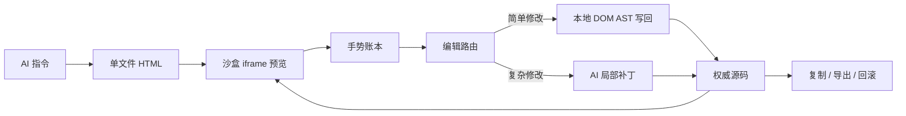

# Framewright

[English](./README.md)

Framewright 是一个面向 AI 生成前端原型的开源可视化编辑框架。它让用户先生成单文件 HTML 界面，再直接在沙盒预览中选择、拖拽、缩放和编辑元素，同时保证源码 HTML、预览画布、历史、回滚、复制和导出路径保持一致。

> 先动手调整设计，再让代码跟上。


## 项目定位

Framewright 重点开源的是编辑技术和框架能力，不是某个演示靶场应用。它的核心是“双层编辑”：

1. AI 生成或更新一个自包含 HTML 原型。
2. 用户在 iframe 预览中直接操作界面。
3. Framewright 把视觉操作记录为结构化手势。
4. 简单修改通过 DOM AST 直接写回权威 HTML 源码。
5. 复杂结构修改才进入 AI 局部补丁流程。
6. 更新后的源码再同步回预览，并进入回滚历史。

这样尺寸、位置、文本、样式等确定性修改不需要等待模型，同时复杂布局仍然可以交给 AI。



## 功能

- React + TypeScript + Vite。
- 使用 `srcdoc` iframe 进行沙盒预览。
- Inspect 模式：悬停、高亮、选中、拖拽、缩放、行内文本编辑。
- 稳定 ID 映射：`data-fw-id`、`data-block-id`、`data-frame-id`。
- 虚拟组件树、组件注册表、Shadow Mapping、Scoped CSS 抽取。
- `SourceEditAdapter` 双层源码编辑接口。
- 本地 DOM AST 快路径：尺寸、位置、文本、安全样式修改直接写源码。
- AI surgical fallback：复杂布局或结构修改才调用模型。
- 补丁快照和回滚账本。
- Prompt 裁剪、语义缓存元数据、AI 调用指标。
- 架构审计脚本，检查模块化能力是否齐全。
- 后台同步不安全时锁定复制/导出。
- 支持 OpenAI-compatible 流式 `/chat/completions`。

## 环境要求

- Node.js 24 或更新版本
- npm
- 如需 AI 生成或 AI fallback，需要 OpenAI-compatible 聊天补全接口

没有模型 Key 时，项目仍可本地运行；但 AI 生成和 AI fallback 功能不可用。

## 本地运行

```bash
npm install
npm run dev
```

打开终端输出的 Vite 地址，通常是：

```text
http://localhost:5173
```

生产构建：

```bash
npm run build
npm run preview
```

## API 配置

Framewright 调用 OpenAI-compatible `/chat/completions` 接口。在本地 Vite dev/preview 环境中，
如果地址是 `localhost` 或 `127.0.0.1`，请求会先走内置本地代理
`/api/framewright/chat/completions`，避免首次试用时被浏览器 CORS 卡住。

默认值：

- Base URL: `https://api.deepseek.com/v1`
- Model: `deepseek-chat`

如果公开部署，不要把模型服务商 API Key 暴露在浏览器 JavaScript 中。推荐使用后端代理：

1. 浏览器把 prompt 和 gesture 数据发给后端。
2. 后端附加服务商 API Key。
3. 后端把模型流式响应转回浏览器。

本地配置注意事项：

- 拉取更新后需要重启 Vite dev server，本地 API 代理才会注册。
- 任何支持流式 chat completions 的 OpenAI-compatible endpoint 都可以使用。
- 不要把 API Key 提交到仓库；浏览器内配置只适合本地实验。

## 使用方法

1. 输入 prompt 并生成界面。
2. 打开 Inspect。
3. 点击元素进行选中。
4. 拖拽选中元素移动位置。
5. 使用缩放手柄调整尺寸。
6. 双击文本进行行内编辑。
7. 查看手势账本和组件树。
8. 简单修改会通过本地源码 AST 立即同步。
9. 只有结构性修改才需要 AI compile。
10. 同步完成后复制或导出 HTML。

## 编辑模型

Framewright 有两层编辑对象：

- 源码层：源码面板中的完整 HTML 文档，是权威数据。
- 原型层：iframe 预览，用于视觉操作和实时展示。

源码层是复制、导出、回滚、Prompt 构建和历史记录的唯一事实来源。预览层负责捕获交互，并镜像最新源码状态。

本地源码 AST 快路径覆盖：

- `resize`
- `move`
- `editText`
- 安全样式修改

这些修改通常会写入：

```html
<style data-fw-scope="fw-source-edits">
```

AI fallback 覆盖：

- 新增或删除组件
- 大范围结构重排
- 无法安全映射到单一目标的修改
- 模糊自然语言设计指令

## 架构

核心模块位于 `src/architecture`：

- `dom.ts`：组件树、注册表、ID 注入、Scoped CSS、Shadow Mapping
- `sourceEdit.ts`：HTML 源码适配器和本地 DOM AST 快路径
- `prompt.ts`：组件级 Prompt 裁剪、路由元数据、缓存键
- `patch.ts`：补丁快照、组件替换校验、回滚工具
- `metrics.ts`：AI / 本地路由耗时和 Prompt 指标
- `manifest.ts`：模块化运行时 manifest，为未来微前端拆分预留边界

架构决策记录位于：

```text
docs/architecture/
```

图文架构说明见：[docs/ARCHITECTURE.md](./docs/ARCHITECTURE.md)。

## 脚本

```bash
npm run dev                 # 启动本地开发服务器
npm run build               # 类型检查并构建生产产物
npm run preview             # 本地预览生产构建
npm run lint                # 运行 ESLint
npm run test                # 运行架构测试
npm run audit:architecture  # 审计模块化架构能力
```

发布或提交 PR 前建议运行：

```bash
npm run lint
npm run build
npm run test
npm run audit:architecture
```

## 安全注意事项

生成的 HTML 会运行在 iframe 中：

```html
sandbox="allow-scripts allow-forms allow-modals allow-popups"
```

这里刻意没有使用 `allow-same-origin`，因此生成页面不应与父应用共享同源身份，也不应直接读取父页面的 `localStorage`。

注意：

- 生成的 HTML 可以在 iframe 中运行 JavaScript。
- 生成的 HTML 可以从用户浏览器发起网络请求。
- 浏览器中保存 API Key 只适合本地实验。
- 公开部署必须使用后端代理调用模型。
- 在加入文件访问、账号系统、插件系统或部署自动化前，应谨慎处理不可信生成 HTML。

详见 [SECURITY.zh-CN.md](./SECURITY.zh-CN.md)。

## 部署

Framewright 是 Vite 静态应用。详见 [DEPLOYMENT.zh-CN.md](./DEPLOYMENT.zh-CN.md)。

常用配置：

- Build command: `npm run build`
- Output directory: `dist`

## 路线图

详见 [ROADMAP.zh-CN.md](./ROADMAP.zh-CN.md)。

## 参与贡献

欢迎贡献。提交 issue 或 pull request 前，请先阅读 [CONTRIBUTING.md](./CONTRIBUTING.md)。

## 许可证

MIT。详见 [LICENSE](./LICENSE)。
