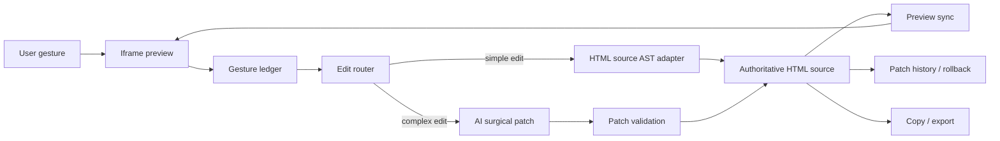
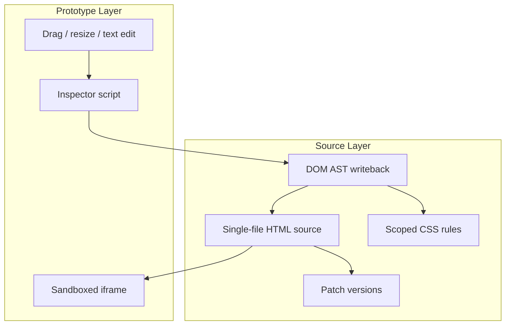
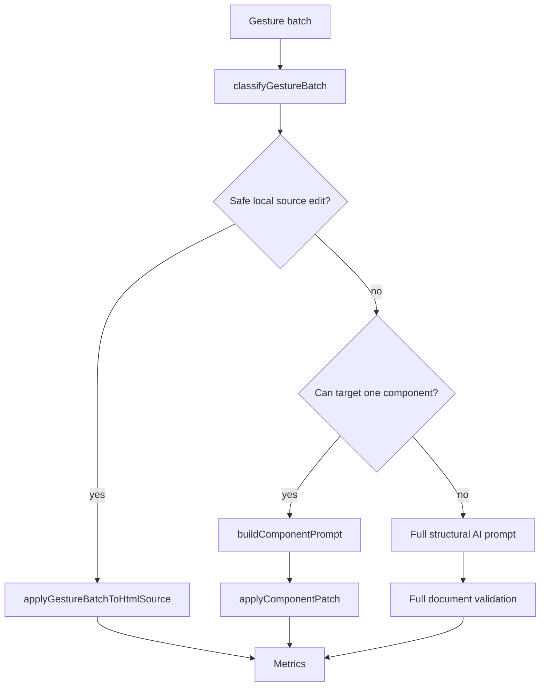

# Framewright Architecture

Framewright is a visual editing framework for AI-generated front-end prototypes. The current source artifact is a self-contained HTML document, and the preview is an iframe interaction surface.

## System Overview



## Dual-Layer Editing

Framewright separates the user-facing preview from the authoritative source.



The source layer is the source of truth for:

- AI prompts
- history
- rollback
- copy
- export
- architecture analysis

The prototype layer is responsible for:

- visual selection
- drag and resize interactions
- inline text editing
- gesture capture
- live preview rendering

## Stable ID Model

Framewright uses three IDs because each layer has different stability needs.

| ID | Purpose |
| --- | --- |
| `data-fw-id` | Stable source-level ID used by AST writeback and future framework adapters. |
| `data-block-id` | Component-level ID used by registry, component tree, and scoped patching. |
| `data-frame-id` | Runtime interaction ID used by iframe inspector and gesture capture. |

## Edit Routing



Local source editing is used for deterministic operations:

- resize
- move
- text edit
- safe style edits

AI fallback is used for:

- adding or deleting components
- large structural changes
- ambiguous natural-language edits
- unsafe target mapping

## Runtime Modules

The v1 implementation is a modular monolith. It uses a manifest boundary so modules can be extracted later.

| Module | Responsibility |
| --- | --- |
| `designer` | App shell, component tree, selected element state, edit orchestration. |
| `preview` | Iframe host, inspector, gesture ledger, DOM morphing. |
| `ai-service` | Prompt routing, semantic cache metadata, streaming model calls. |
| `history` | Patch snapshots, rollback, version ledger. |

## Validation

Architecture checks are executable:

```bash
npm run test
npm run audit:architecture
```

The audit checks for:

- registry and stable IDs
- virtual component tree
- scoped CSS
- shadow mapping
- prompt pruning
- route/cache/metrics
- source AST fast editing
- patch and rollback
- micro-frontend manifest
